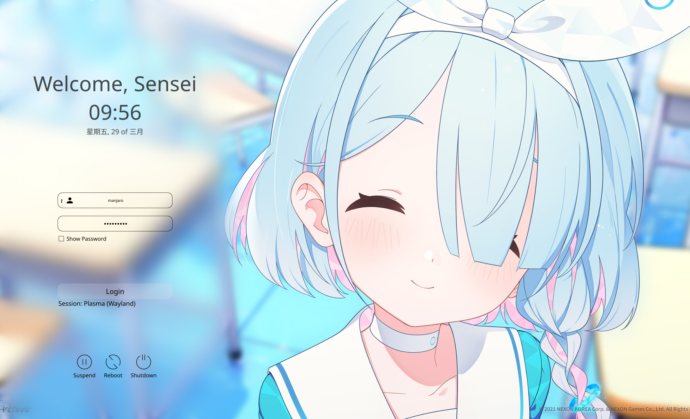

[English](../README.md) | [简体中文](Documents/README.zh.md)

# 简介

从 “Sugar Candy Login” 修改，使其符合碧蓝档案游戏的主题（个人最喜欢的游戏）



# 使用

## 手动安装

从 release 中下载文件，并且解压到 `/usr/share/sddm/themes` 路径（可能需要根据具体的环境下载到不同目录）

```bash
sudo tar -xzvf ~/arona-sddm-login.tar -C /usr/share/sddm/themes
```

接着需要指定使用的 sddm 主题 —— 编辑 `/etc/sddm.conf` （如果不存在可能需要手动创建）

在 `[Theme]` 的单元内指定使用主题 —— `Current=arona-sddm-login`

## 自动安装 (推荐)

只是将手动安装写成了 [install.sh](../install.sh) 而已，但是加入了自定义屏幕分辨率的重新定义 (默认计算当前屏幕分辨率)

```bash
git clone https://github.com/Machillka/arona-sddm-login.git
cd arona-sddm-login
bash install.sh
```

## 对于基于 KDE Plasma 来说

除了直接解压的安装方式，还提供了从商店下载的方式 ——


可以尝试搜索关键词 `arona`

## 常见问题

基于 sddm, qt5-quickcontrols2, qt5-graphicaleffects, qt5-svg
如果使用过程中发现缺乏依赖，可以尝试安装

对于基于 Arch 的：
```bash
sudo pacman -S sddm qt5-quickcontrols2 qt5-graphicaleffects qt5-svg
```

对于基于 Debian 的：
```bash
sudo apt install --no-install-recommends sddm qml‑module‑qtquick‑layouts qml‑module‑qtgraphicaleffects qml‑module‑qtquick‑controls2 libqt5svg5
```

对于基于 Red Hat 的：
```bash
sudo dnf install sddm qt5‑qtgraphicaleffects qt5‑qtquickcontrols2 qt5‑qtsvg
```

# 特别鸣谢

[Sugar Candy login](https://github.com/Kangie/sddm-sugar-candy)