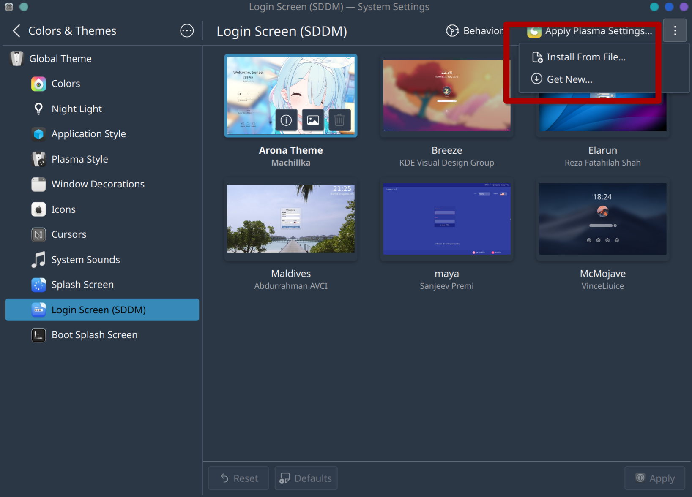

[English](README.md) | [简体中文](Documents/README.zh.md)

# Blue Archive theme login theme for SDDM

Modify some problems in "Sugar Candy login", and make the theme adapted to Blue Archive (my favorite game)


# Usage

## Manual Installation

Fitstly, download the zip file from release page. Then unzip it to your sddm theme directory '`/usr/share/sddm/themes`' (May be different in your os)

```bash
sudo tar -xzvf ~/arona-sddm-login.tar -C /usr/share/sddm/themes
```

After that you will have to point SDDM to the new theme by editing its config file, preferrably at /etc/sddm.conf (create if necessary). You can take the default config file of SDDM as a reference which might be found at: /usr/lib/sddm/sddm.conf.d/sddm.conf.

In the `[Theme]` section simply add the themes name to this line: `Current=arona-sddm-login`.

## Automatic Installation (Recommended)

It can adapt the resolution in your device.

```bash
git clone https://github.com/Machillka/arona-sddm-login.git
cd arona-sddm-login
bash install.sh
```

## For KDE Plasma

Can simply be installed from the store



Searching Keywords `arona`

## Common Problems

This theme is based on sddm, qt5-quickcontrols2, qt5-graphicaleffects, qt5-svg. If you encounter some problems, try to reinstall the dependencies

For Arch based:
```bash
sudo pacman -S sddm qt5-quickcontrols2 qt5-graphicaleffects qt5-svg
```

For Debian based:
```bash
sudo apt install --no-install-recommends sddm qml‑module‑qtquick‑layouts qml‑module‑qtgraphicaleffects qml‑module‑qtquick‑controls2 libqt5svg5
```

For Red Hat based：
```bash
sudo dnf install sddm qt5‑qtquickcontrols2 qt5‑qtgraphicaleffects qt5‑qtsvg
```

# Thanks to

This repo is built up on the [Sugar Candy login](https://github.com/Kangie/sddm-sugar-candy)
